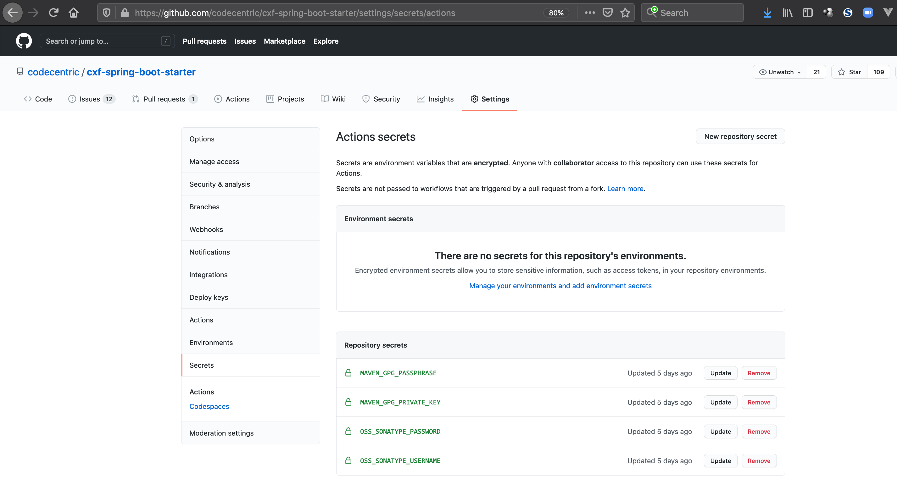

# github-actions-release-maven
Showing how to release to Maven Central using GitHub Actions, create a GitHub release with commitlogs and publishing SNAPSHOT versions to GitHub Packages

# Release to Maven Central using GitHub Actions

For having a release workflow with GitHub Actions it would be nice not create another workflow file, since we don't want to "pollut" the existing push workflow. Therefore...


### How to implement multiple GitHub Actions

See https://stackoverflow.com/a/57610640/4964553 - simply put multiple .yml files into ./github/workflows like:

build.yml
```yaml
name: build

on: [push]

jobs:
  build:
    runs-on: ubuntu-latest

    steps:
    ...
```

release-to-maven-central.yml
```yaml
name: release-to-maven-central
on:
  release:
    types: [created]
jobs:
  publish:
    runs-on: ubuntu-latest
    steps:
      ...
```


### How to manually trigger a GitHub action on: XYZ?

There's a great feature on how to trigger GitHub Actions through the GitHub Actions GUI described here: https://docs.github.com/en/free-pro-team@latest/actions/managing-workflow-runs/manually-running-a-workflow

With a manual "release" trigger through the GitHub Actions GUI, we need to use a manual event (as described here https://docs.github.com/en/free-pro-team@latest/actions/reference/events-that-trigger-workflows#manual-events) in a new `release-to-maven-central.yml` inside our `.github/workflows` directory:

```yaml
name: release-to-maven-central
on:
  workflow_dispatch:
    inputs:
      releaseversion:
        description: 'Release version'
        required: true
        default: '2.4.0'
jobs:
  publish:
    runs-on: ubuntu-latest
    steps:
    - run: |
        echo "Release version ${{ github.event.inputs.releaseversion }}!"
```

Using the `workflow_dispatch:inputs` field we can even configure a GUI element where we can set the release version dynamically.

Ok it seams, we need to merge this workflow to master/main first - since:

> To trigger the workflow_dispatch event on GitHub, your workflow must be in the default branch.

Now it should look like this:


If you let the workflow run by clicking on `run workflow`, it should print out our version:


### How to release to Maven Central

The Actions docs are here: https://docs.github.com/en/free-pro-team@latest/actions/guides/publishing-java-packages-with-maven and they state, that the `setup-java` action already comes with a pre-configured `settings.xml`:

> "...it also configures a Maven settings.xml for publishing packages. By default, the settings file will be configured for GitHub Packages, but it can be configured to deploy to another package registry, such as the Maven Central Repository."

So first we need to create some variables containing the credentials for the Sonatype Maven repo (see the Sonatype docs also: https://central.sonatype.org/pages/apache-maven.html).


### Create encrypted variables in GitHub Actions

To create encrypted variables in GitHub Actions, have a look at https://docs.github.com/en/free-pro-team@latest/actions/reference/encrypted-secrets .

We need both `OSS_SONATYPE_USERNAME` and `OSS_SONATYPE_PASSWORD` for the Sonatype Nexus access and also `MAVEN_GPG_PRIVATE_KEY` and `MAVEN_GPG_PASSPHRASE` for the signing of our artifacts that will get uploaded. Therefor head over to the `Settings` tab of your repository and go to `Secrets`. There should be a button `New repository secret`:



If you ask yourself, which `gpg` file you need to use for `MAVEN_GPG_PRIVATE_KEY` have a look at https://central.sonatype.org/pages/working-with-pgp-signatures.html . If you have multiple private keys listed when running `gpg --list-secret-keys`, you need to export the one you chose for signing the Sonatype artifacts only! This could be done with (see https://unix.stackexchange.com/questions/481939/how-to-export-a-gpg-private-key-and-public-key-to-a-file):

```shell
gpg --output private.pgp --armor --export-secret-key username@email
```

Now fill the contents of the newly exported `private.pgp` into the GitHub repository secret named `MAVEN_GPG_PRIVATE_KEY`.


### Complete the GitHub Action release workflow

Now as the docs state, we can use the pre-configured `settings.xml` from the `setup-java` action to do the Maven release (see https://github.com/actions/setup-java). Depending on your `pom.xml`'s `distributionManagement` section we need to configure the `server-id`. [In my example project](https://github.com/codecentric/cxf-spring-boot-starter/blob/master/pom.xml) this is `oss.sonatype.org`:

```xml
	<distributionManagement>
	   <repository>
	     <id>oss.sonatype.org</id>
	     <url>https://oss.sonatype.org/service/local/staging/deploy/maven2/</url>
	   </repository>
	   <snapshotRepository>
	     <id>oss.sonatype.org</id>
	     <url>https://oss.sonatype.org/content/repositories/snapshots</url>
	   </snapshotRepository>
	</distributionManagement>
```

Now let's complete the `release-to-maven-central.yml` GitHub Actions workflow file:

```yaml
name: release-to-maven-central
on:
  workflow_dispatch:
    inputs:
      releaseversion:
        description: 'Release version'
        required: true
        default: '2.4.0'
jobs:
  publish:
    runs-on: ubuntu-latest
    steps:
      - run: echo "Will start a Maven Central upload with version ${{ github.event.inputs.releaseversion }}"

      - uses: actions/checkout@v2

      - name: Set up Maven Central Repository
        uses: actions/setup-java@v1
        with:
          java-version: 11
          server-id: oss.sonatype.org
          server-username: MAVEN_USERNAME
          server-password: MAVEN_PASSWORD
          gpg-private-key: ${{ secrets.MAVEN_GPG_PRIVATE_KEY }}
          gpg-passphrase: MAVEN_GPG_PASSPHRASE

      - name: Set projects Maven version to GitHub Action GUI set version
        run: mvn versions:set "-DnewVersion=${{ github.event.inputs.releaseversion }}"

      - name: Publish package
        run: mvn --batch-mode clean deploy -P central-deploy -DskipTests=true
        env:
          MAVEN_USERNAME: ${{ secrets.OSS_SONATYPE_USERNAME }}
          MAVEN_PASSWORD: ${{ secrets.OSS_SONATYPE_PASSWORD }}
          MAVEN_GPG_PASSPHRASE: ${{ secrets.MAVEN_GPG_PASSPHRASE }}
```

After configuring the pre-configured `settings.xml`, we set the version number we set in the GitHub actions GUI to our Maven project with the help of the Maven versions plugin. Then we finally deploy our application to Maven Central.


### Tackling the 'gpg: signing failed: Inappropriate ioctl for device' error

You may be running into the `gpg: signing failed: Inappropriate ioctl for device` error ([see this build](https://github.com/codecentric/cxf-spring-boot-starter/runs/1670320855?check_suite_focus=true)). No worries, we simply need to configure the `maven-gpg-plugin` inside our [pom.xml](https://github.com/codecentric/cxf-spring-boot-starter/blob/master/pom.xml). Just add the following `gpgArguments` configuration using the `--pinentry-mode` parameter:

```xml
<plugin>
	<artifactId>maven-gpg-plugin</artifactId>
	<version>${maven-gpg-plugin.version}</version>
	<executions>
	  <execution>
	    <id>sign-artifacts</id>
	    <phase>verify</phase>
	    <goals>
	      <goal>sign</goal>
	    </goals>
		<configuration>
		  <!-- This is necessary for gpg to not try to use the pinentry programs -->
		  <gpgArguments>
			  <arg>--pinentry-mode</arg>
			  <arg>loopback</arg>
		  </gpgArguments>
		</configuration>
	  </execution>
	</executions>
</plugin>
```

Here's a [full successful Maven Central Release GitHub Actions build log](https://github.com/codecentric/cxf-spring-boot-starter/runs/1690791234?check_suite_focus=true).

If you have a look at Maven Central you should find the newly released artifact also (this could take some time though due to synchronisation issues):


# Create a GitHub Release with every Maven Central Release

As we're now able to automatically create Maven Central releases of our project with GitHub Actions it would be also nice to have a GitHub Release on our repositories frontpage containing the newly released `jar` file.

There are multiple release actions out there. I tried to start with the GitHub default [create-release](https://github.com/marketplace/actions/create-a-release) action, which should create a new release for us. Now let's enhance our `release-to-maven-central.yml`:

```yaml
      - name: Create GitHub Release
        id: create_release
        uses: actions/create-release@v1
        env:
          GITHUB_TOKEN: ${{ secrets.GITHUB_TOKEN }}
        with:
          tag_name: ${{ github.event.inputs.releaseversion }}
          release_name: ${{ github.event.inputs.releaseversion }}
          body: |
            Grab the new version from Maven central https://repo1.maven.org/maven2/de/codecentric/cxf-spring-boot-starter/${{ github.event.inputs.releaseversion }}/ by using it in your deps (also use the newest cxf-spring-boot-starter-maven-plugin https://github.com/codecentric/cxf-spring-boot-starter-maven-plugin):

            ```
            <dependencies>
            	<dependency>
            	    <groupId>de.codecentric</groupId>
            	    <artifactId>cxf-spring-boot-starter</artifactId>
            	    <version>${{ github.event.inputs.releaseversion }}</version>
            	</dependency>
            </dependencies>
            ```
          draft: false
          prerelease: false
```

The `release_name` and `tag_name` use the version number we define through the GitHub Actions workflow UI. The action also creates a git tag inside our repo for us - so no need to do this ourselves. Inside the body we add a description of where our newly released `jar` can be downloaded from (Maven Central) and how to embed it into your project.

### Extending the GitHub release with a changelog

It would be really nice to also have a changelog present in the GitHub release. There are multiple actions again that generate changelogs for us automatically. I you're looking for a really simple one, that only lists the commits that are new inside this release compared to the last one, then you'd might have a look at https://github.com/metcalfc/changelog-generator It's usage is really straight forward. Before our `create-release` phase, we add it to generate the changelog:

```yaml
- name: Generate changelog
  id: changelog
  uses: metcalfc/changelog-generator@v0.4.4
  with:
    myToken: ${{ secrets.GITHUB_TOKEN }}
```

And then we use the generated changelog inside our `create-release` step:

```yaml
      - name: Create GitHub Release
        id: create_release
        uses: actions/create-release@v1
        env:
          GITHUB_TOKEN: ${{ secrets.GITHUB_TOKEN }}
        with:
          tag_name: ${{ github.event.inputs.releaseversion }}
          release_name: ${{ github.event.inputs.releaseversion }}
          body: |
            Grab the new version from Maven central https://repo1.maven.org/maven2/de/codecentric/cxf-spring-boot-starter/${{ github.event.inputs.releaseversion }}/ by using it in your deps (also use the newest cxf-spring-boot-starter-maven-plugin https://github.com/codecentric/cxf-spring-boot-starter-maven-plugin):

            ```
            <dependencies>
            	<dependency>
            	    <groupId>de.codecentric</groupId>
            	    <artifactId>cxf-spring-boot-starter</artifactId>
            	    <version>${{ github.event.inputs.releaseversion }}</version>
            	</dependency>
            </dependencies>
            ```

            ### Things that changed in this release
            ${{ steps.changelog.outputs.changelog }}
          draft: false
          prerelease: false
```

Now after a new `release-to-maven-central` workflow run, we should see a new release on our repositories frontpage:


And clicking into the very details of this release, we should see a customized download advice to our released jar - together with a nice changelog list:


# Publish SNAPSHOT versions to GitHub Packages

We can also [publish our Maven artifacts to GitHub Packages](https://docs.github.com/en/free-pro-team@latest/actions/guides/publishing-java-packages-with-maven#publishing-packages-to-github-packages). As we might want to also have our `SNAPSHOT` versions available to the public, we could use GitHub Packages for the SNAPSHOTs and Maven Central for the release versions.

Therefore we need to enhance our workflows a little more. First we need to add GitHub Packages to our `pom.xml`s `distributionManagement` section. As we can't add 2 `repository` tags to `distributionManagement`, we simply use the `snapshotRepository` tag here for GitHub Packages:

```xml
    <distributionManagement>
        <repository>
            <id>oss.sonatype.org</id>
            <url>https://oss.sonatype.org/service/local/staging/deploy/maven2/</url>
        </repository>
        <snapshotRepository>
            <id>github</id>
            <name>GitHub Packages</name>
            <url>https://maven.pkg.github.com/codecentric/cxf-spring-boot-starter</url>
        </snapshotRepository>
    </distributionManagement>
```

Also __mind the `url` of the GitHub Packages configuration__, since it __must match__ your GitHub organisation and repository like this: `https://maven.pkg.github.com/yourOrganisationHere/yourRepositoryNameHere`. Otherwise you'll run into errors like this:

```shell
Could not find artifact de.codecentric:cxf-spring-boot-starter:jar:2.4.0-20210112.171149-1 in github (https://maven.pkg.github.com/jonashackt/cxf-spring-boot-starter)
```

Furthermore I wanted to only start the `publish` job, if the `build` job with it's Matrix build of 3 Java versions was successfully done. Because if you simply concatenate the jobs, both jobs will be run in parallel (see [this build log for example](https://github.com/codecentric/cxf-spring-boot-starter/actions/runs/480285190)):


With GitHub Actions we have 2 options how to implement a sequence of jobs. The first possibility is to create a separate workflow in a separate yaml file and use the [the new](https://github.blog/2020-08-03-github-actions-improvements-for-fork-and-pull-request-workflows/) Actions [`workflow_run` event, which is documented in the docs](https://docs.github.com/en/free-pro-team@latest/actions/reference/events-that-trigger-workflows#workflow_run) as:

> This event occurs when a workflow run is requested or completed, and allows you to execute a workflow based on the finished result of another workflow.

And this event is similar to the `workflow_dispatch` event, which is only triggerable on the default branch (`master` at my example repo). The `workflow_run` event is configured to run, when another workflow ahs finished. I named the new workflow `publish-snapshot.yml`:

```yaml
name: publish-snapshot

# Only trigger a SNAPSHOT release to GitHub Packages, when the build workflow succeeded
on:
  workflow_run:
    workflows: ["build"]
    types:
      - completed

jobs:
  publish-snapshot:
    runs-on: ubuntu-latest

    steps:
    - uses: actions/checkout@v2

    - name: Set up settings.xml for GitHub Packages
      uses: actions/setup-java@v1
      with:
        java-version: 1.8

    - name: Publish SNAPSHOT version to GitHub Packages (we can skip tests, since we only deploy, if the build workflow succeeded)
      run: mvn -B --no-transfer-progress deploy -DskipTests --projects cxf-spring-boot-starter
      env:
        GITHUB_TOKEN: ${{ secrets.GITHUB_TOKEN }}
```

Now this workflow is only triggered, when our `build` workflow has successfully done it's Matrix build with 3 Java versions. I also added the ` -DskipTests` parameter, since this workflow doesn't need to run all tests again - because it's triggered by our `build` workflow, which already ran the tests. I also added `--projects cxf-spring-boot-starter` because I have a Maven multi module project - and only want to publish this module (and not the samples).

The second option is to use [the `needs` keyword inside a job definition](https://docs.github.com/en/free-pro-team@latest/actions/reference/workflow-syntax-for-github-actions#jobsjob_idneeds). This is very elegant, since we can define  the sequence of Action jobs inside the same workflow file like this:

```yaml
name: build

on: [push]

jobs:
  build:
    runs-on: ubuntu-latest

    strategy:
      matrix:
        java-version: [ 8, 11, 15 ]

    steps:
    - uses: actions/checkout@v2
    - uses: actions/setup-java@v1
      with:
        java-version: ${{ matrix.java-version }}
    - run: mvn -B install --no-transfer-progress --file pom.xml

  publish-snapshot:
    needs: build
    runs-on: ubuntu-latest

    steps:
      - uses: actions/checkout@v2

      - name: Set up settings.xml for GitHub Packages
        uses: actions/setup-java@v1
        with:
          java-version: 1.8

      - name: Publish SNAPSHOT version to GitHub Packages (we can skip tests, since we only deploy, if the build workflow succeeded)
        run: mvn -B --no-transfer-progress deploy -DskipTests --projects cxf-spring-boot-starter
        env:
          GITHUB_TOKEN: ${{ secrets.GITHUB_TOKEN }}
```

Also the Actions UI implements this quite nice because we see all depending jobs in one overview:


After a successful `mvn deploy` to GitHub Packages, you should also see a new entry on the frontpage of your repository like this:


Also all your packages regardless which repository they were published from are listed on the organisational level. Just go to `https://github.com/orgs/yourOrganisationNameHere/packages`:


The [docs have even more detailled info on where your packages will be visible](https://docs.github.com/en/free-pro-team@latest/packages/manage-packages/viewing-packages).


# Deploy to GitHub Pages

There's this nice action https://github.com/marketplace/actions/deploy-to-github-pages that easily deploys your let's say Asciidoctor generated docs to GitHub Pages. Add the following to your `workflow.yml`:

```yaml
      - name: Publish SNAPSHOT version to GitHub Packages (we can skip tests, since we only deploy, if the build workflow succeeded)
        run: # run a build of your docs into the directory 'generated-docs' - there JamesIves/github-pages-deploy-action will pick it up

      - name: Deploy Asciidoc docs output to GitHub Pages
        uses: JamesIves/github-pages-deploy-action@3.7.1
        with:
          GITHUB_TOKEN: ${{ secrets.GITHUB_TOKEN }}
          BRANCH: gh-pages # The branch the action should deploy to.
          FOLDER: generated-docs # The folder the action should deploy.
          CLEAN: true # Automatically remove deleted files from the deploy branch
```


If you want to use the Maven `pom.xml`'s current version number, here's an example that uses GitHub Actions [`set-output` variable definition](https://docs.github.com/en/free-pro-team@latest/actions/reference/workflow-commands-for-github-actions#setting-an-output-parameter) to define the version number later used in the Pages deployment Action:


```yaml
      - name: Publish SNAPSHOT version to GitHub Packages (we can skip tests, since we only deploy, if the build workflow succeeded)
        run: mvn -B --no-transfer-progress package --projects your-asciidoc-containing-maven-module -DskipTests
        env:
          GITHUB_TOKEN: ${{ secrets.GITHUB_TOKEN }}

      - name: Extract Maven project version for Asciidoc GitHub Pages directory naming
        run: echo ::set-output name=version::$(mvn -q -Dexec.executable=echo -Dexec.args='${project.version}' --non-recursive exec:exec)
        id: project

      - name: Show extracted Maven project version
        run: echo ${{ steps.project.outputs.version }}

      - name: Deploy Asciidoc docs output to GitHub Pages
        uses: JamesIves/github-pages-deploy-action@3.7.1
        with:
          GITHUB_TOKEN: ${{ secrets.GITHUB_TOKEN }}
          BRANCH: gh-pages # The branch the action should deploy to.
          FOLDER: your-asciidoc-containing-maven-module/target/generated-docs # The folder the action should deploy.
          TARGET_FOLDER: ${{ steps.project.outputs.version }}
          CLEAN: true # Automatically remove deleted files from the deploy branch
```

See it in action here: https://github.com/codecentric/spring-boot-admin

### Links

See manual guide in https://gist.github.com/jonashackt/a09fa064145ff5620c19bc05080378e8

https://github.com/marketplace/actions/create-a-release

https://github.com/marketplace/actions/upload-a-release-asset